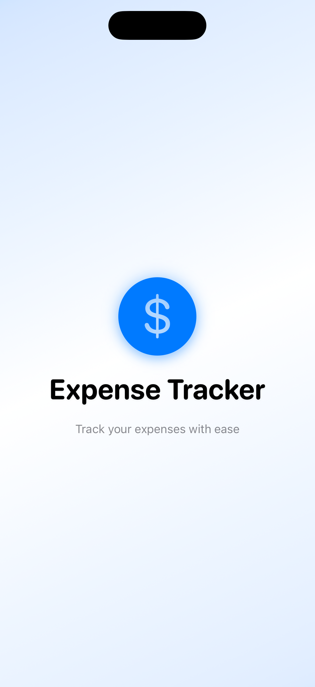
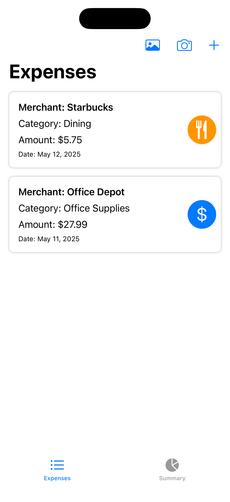
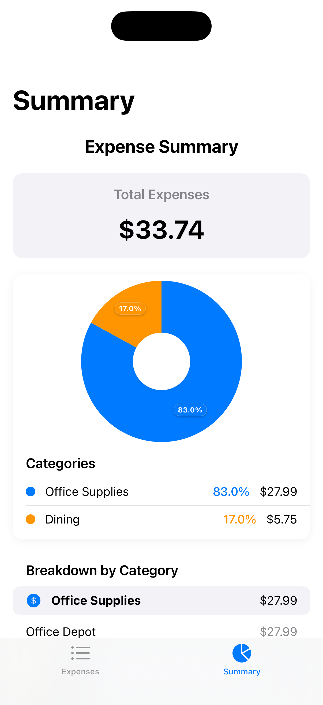
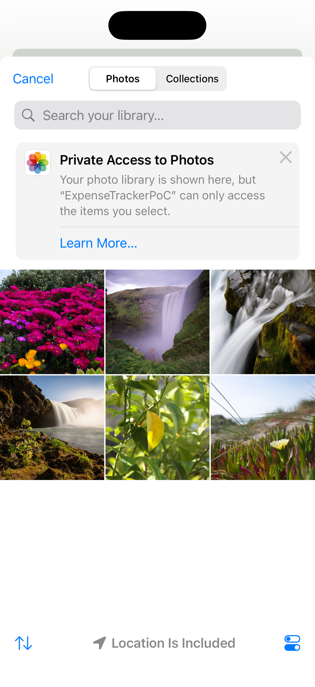
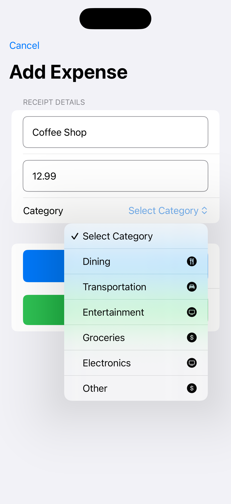
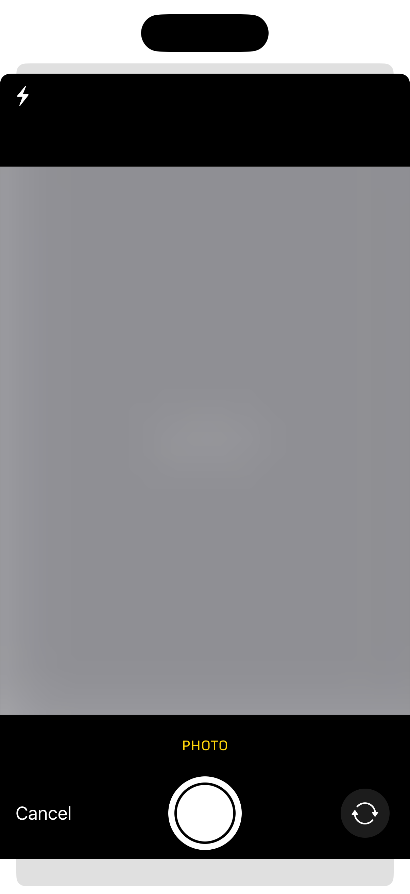

# Expense Tracker Proof of Concept

This Proof of Concept (PoC) is a modern iOS application designed to help users track, categorize, and analyze their expenses. Built with SwiftUI, the app provides an intuitive interface for managing personal finances, leveraging on-device machine learning (via the `phi-2` model) for expense categorization and OCR for receipt scanning. This project is a demonstration and not intended for production use.

<p align="center">
  
</p>

## Table of Contents

- [Features](#features)
- [Requirements](#requirements)
- [Installation](#installation)
- [Usage](#usage)
- [Project Structure](#project-structure)
- [Technologies](#technologies)
- [Implementation Notes](#implementation-notes)
- [Troubleshooting](#troubleshooting)
- [Additional Resources](#additional-resources)
- [License](#license)

## Features

- **Expense Management**: Add, edit, and delete expense records with details such as merchant, amount, category, and date.
- **Category Visualization**: View expenses by category through an interactive pie chart with animated segments and clear percentage labels.
- **Receipt Scanning**: Scan receipts using the camera with the Vision framework for automatic extraction of merchant and amount data.
- **Expense Analysis**: Analyze spending trends and patterns with summary views and category breakdowns.
- **Intuitive Interface**: Enjoy a clean, modern SwiftUI interface with smooth animations, transitions, and accessibility support (e.g., VoiceOver).
- **Persistent Storage**: Store expense data securely in a local SQLite database.

## Requirements

- iOS 15.0 or later (iPhone)
- Xcode 14.0 or later
- Swift 5.5 or later
- macOS Monterey (12.0) or later for development
- A12 Bionic chip or later for on-device machine learning

## Installation

### Clone the Repository

```bash
git clone https://github.com/vihuvac/ExpenseTrackerPoC.git
cd ExpenseTrackerPoC
```

### Open in Xcode

1. Double-click the `ExpenseTrackerPoC.xcodeproj` file to open the project in Xcode
2. Alternatively, open Xcode and select "Open a project or file" and navigate to the project location

### Build and Run

1. Select your target device or simulator from the scheme menu
2. Press `Cmd+R` or click the "Run" button to build and run the application

### Dependencies

The app uses Swift Package Manager for dependency management. The required packages will be automatically resolved when you open the project in Xcode.

## Screenshots

The following screenshots showcase the app’s key features and user interface in light mode. Dark mode is also supported for an enhanced user experience.

<table align="center">
  <tr align="center">
    <td>
      
      <br>Splash Screen
    </td>
    <td>
      
      <br>Expense List
    </td>
    <td>
      
      <br>Summary View
    </td>
  </tr>

  <tr align="center">
    <td>
      
      <br>Add Expense
    </td>
    <td>
      
      <br>Expense Form
    </td>
    <td>
      
      <br>Receipt Scanning
    </td>
  </tr>
</table>

## Usage

### Adding an Expense

> **Note**:
>
> The `phi-2` model will automatically process receipts or taken photographs to complete the expense form.

1. Launch the app to view the main screen.
2. Tap the "+" button to add an expense **manually**.
3. In the expense form, enter the merchant name, amount, and category. Optionally, use the **Select Receipt** option to attach the receipt image and fill out the form automatically.
4. Tap **Categorize** to save the expense to your records.

### Viewing Expense Summary

1. Tap **View Summary** on the main screen.
2. Explore the interactive pie chart displaying expenses by category.
3. Scroll to view detailed breakdowns by category.

### Scanning Receipts

1. From the main screen, tap the **image icon** or **camera icon**.
2. For the **camera icon**, capture a receipt image using the camera. For the **image icon**, choose an image from Photos.
3. The app uses the Vision framework to extract merchant and amount data when possible.
4. Review and adjust the extracted details in the expense form, then tap **Categorize** to save.

## Project Structure

```
ExpenseTrackerPoC/
├── Models/           # Data models and database management
│   ├── DatabaseManager.swift  # SQLite database operations
│   ├── Expense.swift          # Core expense model
│   ├── ExpenseViewModel.swift # View model for expense operations
│   ├── ModelManager.swift     # Central model manager
│   └── OCRManager.swift       # Receipt scanning functionality
├── Views/            # SwiftUI view files
│   ├── CameraView.swift       # Camera interface for scanning receipts
│   ├── ExpenseFormView.swift  # Form for adding/editing expenses
│   ├── ExpenseListView.swift  # List of all expenses
│   ├── PieSegmentView.swift   # Custom pie chart segments
│   ├── SummaryView.swift      # Expense summary with visualizations
│   └── [Other view files]     # Additional UI components
└── Supporting Files  # Configuration and app lifecycle files
```

## Technologies

- **SwiftUI**: Declarative framework for building a modern UI with animations, transitions, and accessibility support.
- **SQLite**: Local database for secure and efficient expense storage.
- **Vision Framework**: On-device OCR for extracting merchant and amounting data from receipt images.
- **MLXLLM with phi-2**: On-device machine learning for expense categorization using the `phi-2` model.
- **Swift Concurrency**: Async/await for non-blocking operations, such as OCR processing and model loading.
- **MVVM Architecture**: Model-View-ViewModel pattern for separating data, logic, and UI concerns.
- **Swift Package Manager**: Dependency management for `MLX`, `MLXLLM`, `MLXLMCommon`, and `Tokenizers`.

## Implementation Notes

### SplashView Dark Mode Support

The `SplashView` adapts seamlessly to light and dark modes, ensuring a visually appealing experience:
- Uses `@Environment(\.colorScheme)` to detect the device’s appearance setting.
- Adjusts gradient backgrounds, logo colors, and text styles for optimal contrast.
- See `Screenshots/SplashViewLight.png` for the light mode appearance (dark mode also supported).

```swift
// Adaptive styling in SplashView
LinearGradient(
  gradient: Gradient(
    colors: showGradient
      ? [
        Color.blue.opacity(colorScheme == .dark ? 0.15 : 0.2),
        Color(UIColor.systemBackground),
        Color.blue.opacity(colorScheme == .dark ? 0.1 : 0.15)
      ]
      : [Color(UIColor.systemBackground), Color(UIColor.systemBackground)]
  ),
  startPoint: .topLeading,
  endPoint: .bottomTrailing
)
```

### Optimized App Startup with Parallel Loading

The app’s startup sequence in `RootView` balances a smooth splash screen with efficient model loading:

1. Displays the `SplashView` immediately, showcasing the app’s logo and animations.
2. Loads the `phi-2` model in parallel using Swift Concurrency.
3. Ensures a minimum splash screen duration (2.5 seconds) for animation playback.
4. Transitions to the main `ContentView` with a 0.7-second fade animation once the model is loaded and the minimum duration has elapsed.

This approach enhances user experience by:

- Providing immediate visual feedback via the splash screen.
- Minimizing wait time through parallel model loading.
- Ensuring consistent animation playback.

```swift
// Startup logic in RootView
struct RootView: View {
  @StateObject private var viewModel = ExpenseViewModel(isPreviewMode: false)

  @State private var isAppLoaded = false
  @State private var isModelLoaded = false
  @State private var minimumSplashTimeElapsed = false

  var body: some View {
    ZStack {
      if !isAppLoaded {
        SplashView()
          .transition(.opacity)
      } else {
        ContentView()
          .environmentObject(viewModel)
          .transition(.opacity)
      }
    }
    .task {
      // Start model loading immediately
      Task {
        await viewModel.loadModel()
        isModelLoaded = true
        checkAndTransition()
      }
      // Ensure minimum splash screen duration
      try? await Task.sleep(nanoseconds: 2_500_000_000)
      minimumSplashTimeElapsed = true
      checkAndTransition()
    }
  }

  private func checkAndTransition() {
    if isModelLoaded && minimumSplashTimeElapsed {
      withAnimation(.easeInOut(duration: 0.7)) {
        isAppLoaded = true
      }
    }
  }
}
```

> **Note**:
>
> The splash screen remains displayed until both model loading and the minimum duration are complete, ensuring a seamless experience. See the Troubleshooting (#troubleshooting) section for model-related issues.

## Troubleshooting

- **Model Fails to Download or Cache**:
  - Ensure a stable internet connection and sufficient storage (~2 GB).
  - Verify the cache directory: `~/Library/Caches/MLXModels/mlx-community_phi-2-hf-4bit-mlx`.
  - Check console logs for errors (e.g., “Failed to list cache directory”).
  - Ensure `MLXLLM` version is pre-2024 in `Package.swift`.

- **Receipt Scanning Fails**:
  - Ensure the receipt image is clear and well-lit.
  - If “Merchant not recognized” or “Amount not recognized” appears, enter details manually.
  - Check console logs for OCR errors (e.g., “VNRecognizeTextRequest error”).

- **Camera Issues**:
  - If the camera fails to process receipts, ensure camera permissions are granted.
  - Test on a different device or simulator to rule out hardware-specific issues.
  - Check logs for errors like “Failed to find a valid fallback video configuration”.

- **App Hangs or Crashes**:
  - Run without debugger (`Product > Run`) to reduce hangs.
  - Profile with Instruments for hangs exceeding 1 second.
  - Collect a sysdiagnose: `Settings > Privacy > Analytics & Improvements > Analytics Data`.

## Additional Resources

### SwiftUI Resources

- [Apple SwiftUI Documentation](https://developer.apple.com/documentation/swiftui)
- [SwiftUI by Example](https://www.hackingwithswift.com/quick-start/swiftui)
- [SwiftUI Handbook](https://designcode.io/swiftui-handbook)
- [Stanford CS193p - SwiftUI Course](https://cs193p.sites.stanford.edu/)

### Design Patterns

- [MVVM in SwiftUI](https://www.raywenderlich.com/4161005-mvvm-with-swiftui)
- [SwiftUI and Combine](https://www.kodeco.com/books/combine-asynchronous-programming-with-swift/v2.0/chapters/15-in-practice-combine-swiftui)

### Charts and Visualizations

- [Charts in SwiftUI](https://developer.apple.com/documentation/Charts)
- [Creating Custom Charts](https://developer.apple.com/documentation/charts/creating-a-chart-using-swift-charts)

## License

This project is licensed under the MIT License - see the [LICENSE](./LICENSE) file for details.

---

Developed by Víctor Hugo Valle Castillo © 2025
